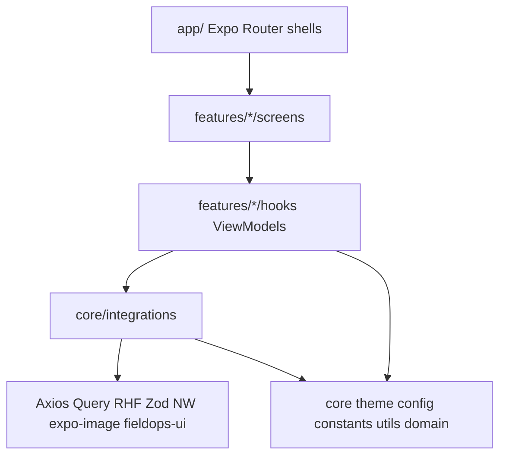

# FieldOps App Foundation Implementation Plan

> **For agentic workers:** Execute task-by-task. Steps use checkbox (`- [ ]`) syntax. After each **Commit + Push** step, push `main` to `origin` (`https://github.com/pranadwaghmare2/fieldops-app.git`). Repo currently has **no commits**; preserve [`mock-api/`](fieldops-app/mock-api/) unchanged.

**Goal:** Runnable Expo SDK 57 app shell with architecture folders, Cursor rules, agent docs, and integration ports — no work-order feature UI yet.

**Architecture:** Feature MVVM (hooks) under `src/features/*`; third-party only via `src/core/integrations/*`; FieldOps tokens in `src/core/theme` matching `@pranadwaghmare2/fieldops-ui` preset; thin Expo Router `app/` shells.

**Tech Stack:** Expo SDK 57, Expo Router, TypeScript strict, NativeWind v4, Tailwind 3, `@pranadwaghmare2/fieldops-ui`, TanStack Query, Axios, RHF, Zod, `expo-image` (behind image integration).

**Plan file on disk (execution):** Also write this plan verbatim to [`docs/plan-foundation.md`](fieldops-app/docs/plan-foundation.md) in Task 0. Ignore [`docs/temp/`](fieldops-app/docs/temp/). Do **not** create `docs/superpowers/`.

## Global Constraints

- Expo **SDK 57** only (not SDK 51 from library `example-expo`).
- Scaffold with **`blank-typescript@sdk-57`** (`npx create-expo-app@latest … --template blank-typescript@sdk-57`); add Expo Router after.
- Separate repos — install UI via npm `@pranadwaghmare2/fieldops-ui`.
- Do not modify [`mock-api/server.js`](fieldops-app/mock-api/server.js).
- No auth, offline, settings, EAS, dark mode, feature screens.
- Features/screens never import `axios`, `@tanstack/*`, `react-hook-form`, `zod`, `nativewind`, `@pranadwaghmare2/fieldops-ui`, `expo-image` by package path — only `src/core/integrations/*`.
- Theme = FieldOps brief tokens only; no second palette.
- Conventional Commits; **commit + push per layer** (human already requested).
- npm as package manager (lockfile `package-lock.json`).



## File map (create)

| Path | Responsibility |
| --- | --- |
| `app/_layout.tsx`, `app/index.tsx` | Providers + placeholder home |
| `src/core/theme/*` | FieldOps tokens only |
| `src/core/config/*` | JSON + `EXPO_PUBLIC_API_URL` |
| `src/core/constants/*` | Messages, status enums |
| `src/core/utils/*` | App-wide pure helpers (date stub) |
| `src/core/domain/*` | WorkOrder/User types stubs |
| `src/core/integrations/{http,query,form,styling,ui,image}/*` | Ports/adapters (stubs OK) |
| `src/features/work-orders/{list,detail,form}/{hooks,components,screens,constants,utils}/` | Empty `.gitkeep` or index barrels |
| `.cursor/rules/000`–`090` + move ponytail to `050` | Agent law |
| `CLAUDE.md`, `AGENTS.md` | Mirror UI lib shape, app-specific |
| `DECISIONS.md`, `README.md`, `.env.example` | Grader + runbook |
| `docs/plan-foundation.md`, `docs/architecture-foundation.md` | Plan + design summary |

---

### Task 0: Persist plan + architecture doc

**Files:**
- Create: `docs/plan-foundation.md`
- Create: `docs/architecture-foundation.md` (condensed approved design §§1–5)

- [ ] **Step 1:** Write both docs (normal prose). Include performance rules and image-integration note. Exclude `docs/temp` content.

- [ ] **Step 2: Commit + Push**

```bash
git add docs/plan-foundation.md docs/architecture-foundation.md
git commit -m "$(cat <<'EOF'
docs: add foundation architecture and implementation plan

EOF
)"
git push -u origin HEAD
```

---

### Task 1: Cursor rules pack (000–090)

**Files:**
- Create: `.cursor/rules/000-architecture.mdc` … `090-forms.mdc` (list below)
- Delete/rename: [`.cursor/rules/010-ponytail.mdc`](fieldops-app/.cursor/rules/010-ponytail.mdc) → `050-ponytail.mdc`

**Rule contents (must encode decided law):**

| File | Must include |
| --- | --- |
| `000-architecture.mdc` | Folder tree, dependency direction, SOLID per layer, `core/theme` = FieldOps tokens only, feature subfolders `hooks/components/screens/constants/utils`, Expo Router thin `app/` |
| `010-coding-and-docs.mdc` | Strict TS, screen = dumb, TSDoc export + internal + tests, **performance**: jank-free, virtualize long lists, server-side filter/search preferred over filtering huge local state lists, `React.memo`/`useCallback`/`useMemo` when list/profiler needs it (not blanket), debounce search, stable `keyExtractor`, animations `useNativeDriver` / Reanimated worklets when motion exists; concrete list/filter choices deferred to feature work |
| `020-testing.mdc` | Risk surface (cursor merge, status rollback, Zod urgent/48h, 422 map, 409 no silent loss); skip snapshots/pixel/% |
| `030-decisions.mdc` | Single root `DECISIONS.md`: grader sections + working feature notes below divider |
| `040-git-commits.mdc` | Conventional Commits; scopes `core`, `integrations`, `work-orders`, `router`, `docs`, `chore`; layer sequence |
| `050-ponytail.mdc` | Existing ponytail text unchanged |
| `060-styling-nativewind.mdc` | Host NW v4 + UI preset + `content` includes `node_modules/@pranadwaghmare2/fieldops-ui/lib/**/*`; no second theme |
| `070-integrations.mdc` | Ban direct vendor imports in features; ports: http, query, form, styling, ui, **image** (`expo-image` adapter for fast image display when needed) |
| `080-tanstack-query.mdc` | Key factory, infinite cursor, optimistic status + rollback, list/detail cache coherence; industry defaults |
| `090-forms.mdc` | `useAppForm`, Zod mirror server rules, 422 field map, 409 UX, checklist max 10, keyboard |

- [ ] **Step 1:** Write all `.mdc` files with `alwaysApply: true` frontmatter where appropriate (match UI lib style).

- [ ] **Step 2: Commit + Push**

```bash
git add .cursor/rules/
git commit -m "$(cat <<'EOF'
chore(cursor): add app architecture and engineering rules

EOF
)"
git push
```

---

### Task 2: CLAUDE.md + AGENTS.md

**Files:**
- Create: `CLAUDE.md`, `AGENTS.md`

Mirror structure of [`fieldops-ui/CLAUDE.md`](fieldops-ui/CLAUDE.md) and [`fieldops-ui/AGENTS.md`](fieldops-ui/AGENTS.md):

- Map → `.cursor/rules/*`
- App identity: Expo FieldOps consumer, not component library
- Non-negotiables: SDK 57, npm UI package, integrations boundary, theme tokens, three screens later, required libs
- Rule index table `000`–`090`
- AGENTS: setup commands (`npm install`, `npm start`, mock-api), task loop (layer placement), never-do list (no monorepo collapse, no feature scope in foundation PRs unprompted, no commit unless asked — **except** this foundation plan explicitly requires commit+push per task)
- Decisions path: root `DECISIONS.md` (not `docs/decisions.md`)

- [ ] **Step 1:** Write both files.

- [ ] **Step 2: Commit + Push**

```bash
git add CLAUDE.md AGENTS.md
git commit -m "$(cat <<'EOF'
docs: add CLAUDE.md and AGENTS.md for agent workflow

EOF
)"
git push
```

---

### Task 3: Expo SDK 57 scaffold (preserve mock-api)

**Files:** root Expo project files (`package.json`, `app.json`, `tsconfig.json`, `babel.config.js`, `metro.config.js`, `app/`, etc.)

**Scaffold choice:** plain TypeScript blank template (`blank-typescript@sdk-57`) — not `default` / tabs. Expo Router added next (design needs thin `app/` shells).

- [ ] **Step 1:** Scaffold without wiping `mock-api/`, `docs/`, `.cursor/`:

```bash
npx create-expo-app@latest /tmp/fieldops-expo-scaffold --template blank-typescript@sdk-57
```

Copy root project files into repo (`package.json`, `app.json`, `tsconfig.json`, `App.tsx`, `index`/entry assets, `.gitignore`). Keep `mock-api/`, `docs/`, `.cursor/`. Blank template ships `App.tsx` — do **not** keep it as long-term entry.

Verify scaffold `package.json` has `expo` in `~57` band.

- [ ] **Step 2:** Add Expo Router + peers, then switch entry off `App.tsx`:

```bash
npx expo install expo-router react-native-safe-area-context react-native-screens expo-linking expo-constants expo-status-bar expo-image react-native-reanimated
npm install @pranadwaghmare2/fieldops-ui @tanstack/react-query axios react-hook-form @hookform/resolvers zod nativewind
npm install -D tailwindcss@^3
```

Then:
- Set `package.json` `"main": "expo-router/entry"`
- Create root `app/_layout.tsx` + `app/index.tsx` (placeholder)
- Delete `App.tsx` (and any blank `index.js` that pointed at App)
- `tsconfig` paths: `"@/*": ["./src/*"]`
- Enable typed routes / scheme in `app.json` per Expo Router install docs

Verify: `npx expo-doctor` (or start help) succeeds on SDK 57.

- [ ] **Step 3:** NativeWind host: `global.css`, `metro.config.js` `withNativeWind`, babel preset, `tailwind.config.js`:

```js
// tailwind.config.js
module.exports = {
  content: [
    './app/**/*.{js,jsx,ts,tsx}',
    './src/**/*.{js,jsx,ts,tsx}',
    './node_modules/@pranadwaghmare2/fieldops-ui/lib/**/*.{js,jsx,ts,tsx}',
  ],
  presets: [
    require('nativewind/preset'),
    require('@pranadwaghmare2/fieldops-ui/preset'),
  ],
};
```

- [ ] **Step 4:** Scripts in `package.json`: `start`, `ios`, `android`, `mock-api` → `node mock-api/server.js`. Add `.gitignore` for `.env`, `node_modules`, `.expo`.

- [ ] **Step 5: Commit + Push**

```bash
git add package.json package-lock.json app.json tsconfig.json babel.config.js metro.config.js tailwind.config.js global.css app/ .gitignore
git commit -m "$(cat <<'EOF'
chore: scaffold Expo SDK 57 blank-typescript with NativeWind and fieldops-ui

EOF
)"
git push
```

---

### Task 4: Core theme, config, constants, utils, domain

**Files:**
- Create: `src/core/theme/tokens.ts`, `src/core/theme/index.ts`
- Create: `src/core/config/app.config.json`, `src/core/config/env.ts`, `src/core/config/index.ts`
- Create: `src/core/constants/messages.ts`, `src/core/constants/status.ts`, `src/core/constants/index.ts`
- Create: `src/core/utils/date.ts`, `src/core/utils/index.ts`
- Create: `src/core/domain/work-order.ts`, `src/core/domain/user.ts`, `src/core/domain/index.ts`
- Create: `.env.example`

**tokens.ts** — exact brief values (match UI lib): bg `#FFFFFF`, surface `#F6F7F9`, border `#E3E6EA`, fg `#111827`, fg-muted `#6B7280`, primary `#1D4ED8`, primary-fg `#FFFFFF`, danger `#DC2626`, warning `#D97706`, success `#15803D`; status maps; spacing 1=4…8=32; type scale; radius 10.

**app.config.json** — e.g. `httpTimeoutMs`, `searchDebounceMs`, `pageSize` (20), no secrets.

**env.ts** — read `process.env.EXPO_PUBLIC_API_URL`; throw clear error if missing in dev when http used later.

**.env.example:**

```
EXPO_PUBLIC_API_URL=http://localhost:4000
```

- [ ] **Step 1:** Implement files with TSDoc on exports.

- [ ] **Step 2: Commit + Push**

```bash
git add src/core/theme src/core/config src/core/constants src/core/utils src/core/domain .env.example
git commit -m "$(cat <<'EOF'
feat(core): add theme tokens, config, constants, and domain types

EOF
)"
git push
```

---

### Task 5: Integration stubs (http, query, form, styling, ui, image)

**Files under** `src/core/integrations/`:

| Port | Produce |
| --- | --- |
| `http/` | `createApiClient()`, `ApiError` type, empty `workOrdersApi`/`usersApi` method signatures (implement later) |
| `query/` | `QueryProvider`, `useAppQuery`/`useAppMutation`/`useAppInfiniteQuery` thin wrappers, `queryKeys` stub |
| `form/` | `useAppForm`, `applyServerFieldErrors`, re-export schema helper wrapping zod |
| `styling/` | `import '@/…/global.css'` side-effect doc; any compose helper if needed |
| `ui/` | Re-export `Button`, `Text`, `TextField`, `Select`, `Badge` from `@pranadwaghmare2/fieldops-ui` |
| `image/` | `AppImage` wrapping `expo-image` (`Image` from `expo-image`) — fast caching image for when screens need images; features import only from here |

Each folder: `index.ts` public port only. TSDoc states “swap vendor here”.

- [ ] **Step 1:** Implement stubs so TypeScript compiles; providers exportable.

- [ ] **Step 2: Commit + Push**

```bash
git add src/core/integrations
git commit -m "$(cat <<'EOF'
feat(integrations): add http query form styling ui and image ports

EOF
)"
git push
```

---

### Task 6: Feature folder shells + router providers

**Files:**
- Create empty structure under `src/features/work-orders/{list,detail,form}/{hooks,components,screens,constants,utils}/` (`.gitkeep`)
- Modify: `app/_layout.tsx` — `QueryProvider`, SafeArea, Stack
- Modify: `app/index.tsx` — placeholder Text from `integrations/ui` (“FieldOps”) + note mock-api; **no** work-order list yet

- [ ] **Step 1:** Wire layout providers from integrations only.

- [ ] **Step 2:** Verify:

```bash
npm start
# expect Metro up; Expo Go / ios / android can open placeholder
```

- [ ] **Step 3: Commit + Push**

```bash
git add app/ src/features/
git commit -m "$(cat <<'EOF'
feat(router): wire providers and feature folder shells

EOF
)"
git push
```

---

### Task 7: DECISIONS.md + README + Jest baseline

**Files:**
- Create: `DECISIONS.md` (grader sections stubs + `## Working notes` divider)
- Create/overwrite: `README.md` — clone → mock-api → `.env` LAN IP → `npm install` → `npm start` / ios / android; Expo Go must match SDK 57; fieldops-ui npm note; CHAOS=0 tip
- Create: Jest config minimal + one smoke test e.g. `src/core/theme/tokens.test.ts` asserting primary hex (proves test harness)

- [ ] **Step 1:** Write docs + smoke test; `npm test` passes.

- [ ] **Step 2: Commit + Push**

```bash
git add DECISIONS.md README.md jest.config.js src/core/theme/tokens.test.ts package.json
git commit -m "$(cat <<'EOF'
docs: add README, DECISIONS stub, and test harness smoke

EOF
)"
git push
```

---

### Task 8: Final verify

- [ ] **Step 1:** From clean mental model:

```bash
node mock-api/server.js &
cp -n .env.example .env
npm install
npm start
npm test
npx tsc --noEmit
```

- [ ] **Step 2:** Confirm no feature screen logic; `git log --oneline` shows layer commits; `git status` clean; remote up to date.

---

## Self-review (plan vs decided design)

| Decision | Task |
| --- | --- |
| Approach 1 folders + MVVM hooks | 4–6 |
| Integrations for all vendors + RHF + image | 5 |
| Expo Router thin `app/` + features under `src` | 3, 6 |
| `EXPO_PUBLIC_API_URL` | 4, 7 |
| npm `@pranadwaghmare2/fieldops-ui` | 3, 5 |
| Single `DECISIONS.md` | 7, rule 030 |
| Rules 000–090 numbering | 1 |
| Performance guardrails not feature recipes | 1 (`010`) |
| CLAUDE/AGENTS like UI lib | 2 |
| No superpowers/temp | 0 |
| Commit+push per layer | every task |
| No feature development | all tasks |

**Out of scope (later plans):** list infinite query, detail optimistic status, create/edit form, 409 UX implementation.
